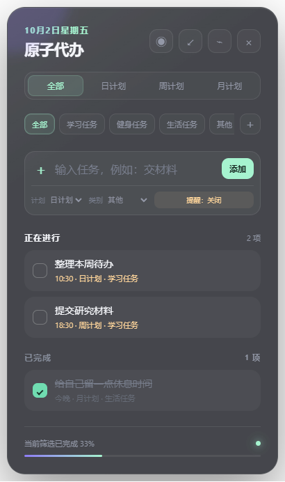

# 原子代办

一个轻巧、有趣、常驻桌面的 Windows 待办清单。它支持任务分类、日/周/月计划、定时提醒以及可以拖动的超紧凑模式。



## 功能

- 日计划、周计划、月计划与“全部”视图
- 日常计划每天自动生成；未完成的上一份任务会阻止重复添加
- 删除日常任务时可选择仅删除本次，或永久停止以后重复
- 可新增、删除的自定义任务分类
- 计划周期和任务分类组合筛选
- 指定日期、时间以及提前 5/10/30 分钟提醒
- 原生 Windows 通知
- 普通、紧凑、超紧凑三种显示模式
- 日常任务采用独立的紫色背景和文字配色
- 超紧凑按钮可拖动，单击恢复完整窗口
- 自动记住窗口位置，并优先显示在副屏
- 数据仅保存在本机，不需要账号或联网

## 下载与使用

前往项目的 [版本发布页面](https://github.com/GaoYq0731/atomic-todo/releases) 下载：

- `AtomicTodo-Setup-*.exe`：安装版
- `AtomicTodo-Portable-*.exe`：免安装版

提醒功能需要保持应用运行，并允许 Windows 显示应用通知。

## 本地开发

需要 Node.js 22.12 或更高版本，以及 pnpm 10。

```powershell
pnpm install
pnpm start
```

检查代码语法：

```powershell
pnpm check
```

生成 Windows 安装包或免安装版：

```powershell
pnpm dist
pnpm portable
```

构建结果位于 `dist/`。

## 数据与隐私

任务数据保存在应用的本地用户数据目录中，不会上传至服务器。卸载应用或清理系统应用数据前，请自行备份重要内容。

## 项目结构

```text
atomic-todo/
├─ build/       # 图标和 Windows 安装脚本
├─ electron/    # 桌面程序主进程与安全桥接
├─ prototype/   # HTML、CSS 和界面逻辑
└─ docs/        # 项目截图
```

## 参与贡献

欢迎通过“问题反馈”提出建议，也欢迎提交代码改进。开始之前请阅读[参与贡献指南](CONTRIBUTING.md)。

## 开源许可

本项目采用 [MIT 开源许可证](LICENSE)。
